<h1 align="center">Music Overlay</h1>

  
  
  

  
Enjoy videos and music with the screen off! Music Overlay saves battery, enhances volume control with swipes, and features a customizable handler for quick screen control.

 

### Description
Introducing Music Overlay – the ultimate companion for optimizing your multimedia experience and saving battery life. With Music Overlay, you can play videos, listen to podcasts, record videos, take selfies, and more, all with your screen turned off. This app is designed for AMOLED and OLED devices, utilizing the power-saving benefits of displaying black or customized overlays when the screen is off

## Screenshots

|              Main Screen              |        Main Screen Collapsed         |               About               |
|:-------------------------------------:|:------------------------------------:|:---------------------------------:|
|        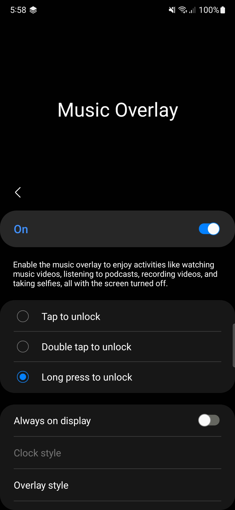         |   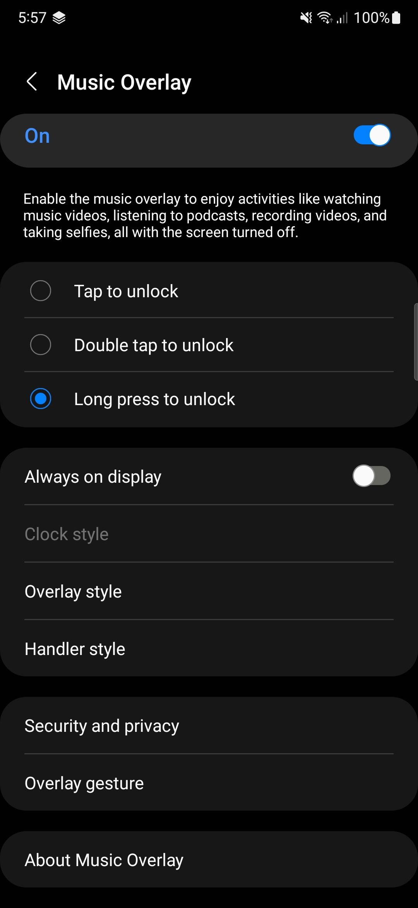   |      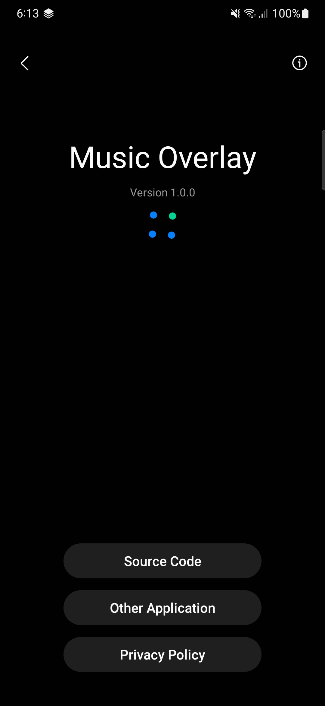      |
|              Visualizers              |              Appearance              |           Music Overlay           |
| 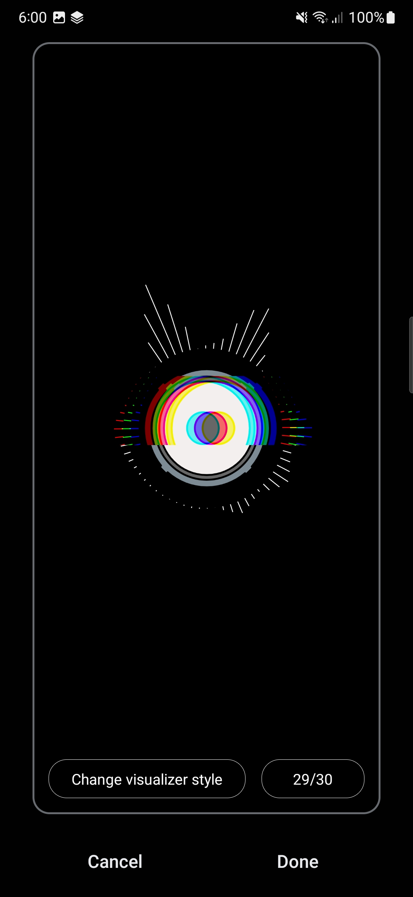 | 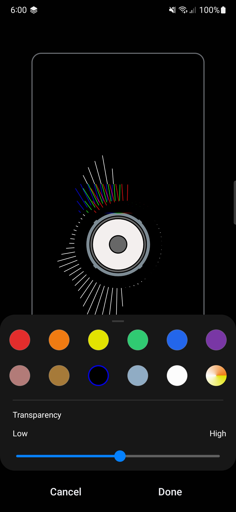 |  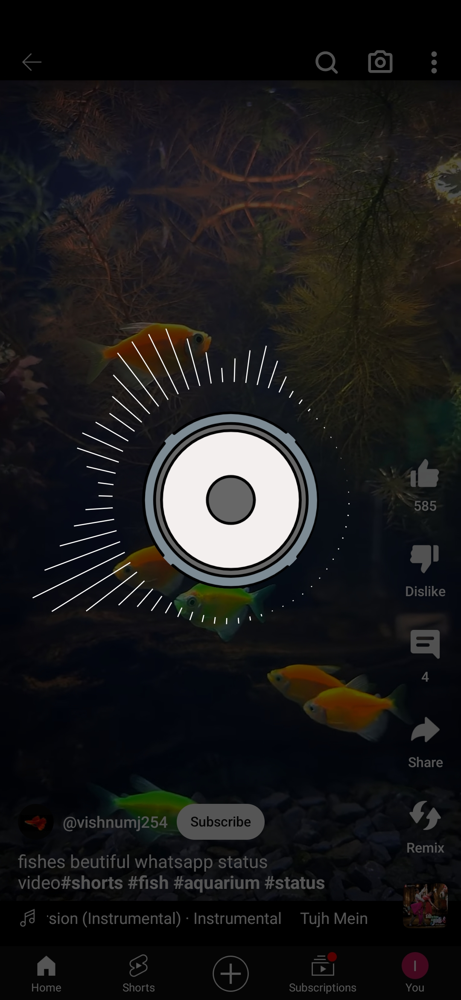  |
|              AOD Clocks               |            AOD Appearance            |           Handler Style           |
|     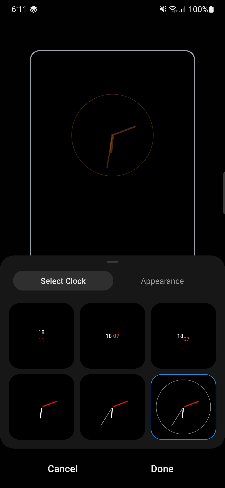      |   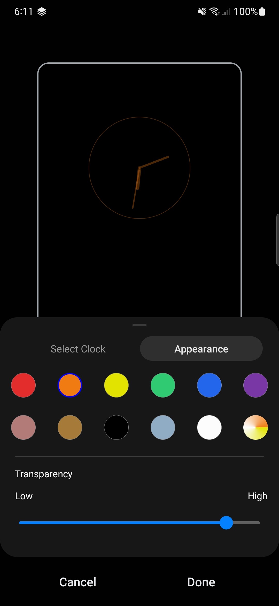   |  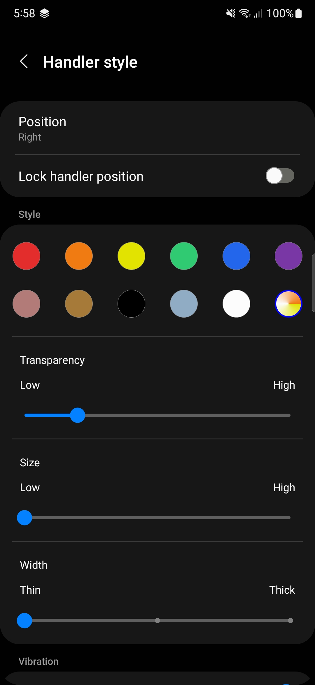  |
|                Gesture                |               Security               |          Overlay Service          |
|       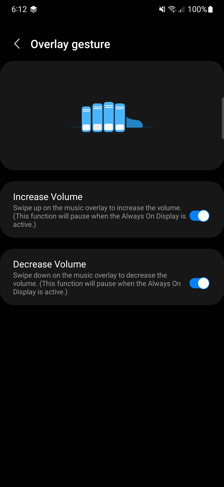       |      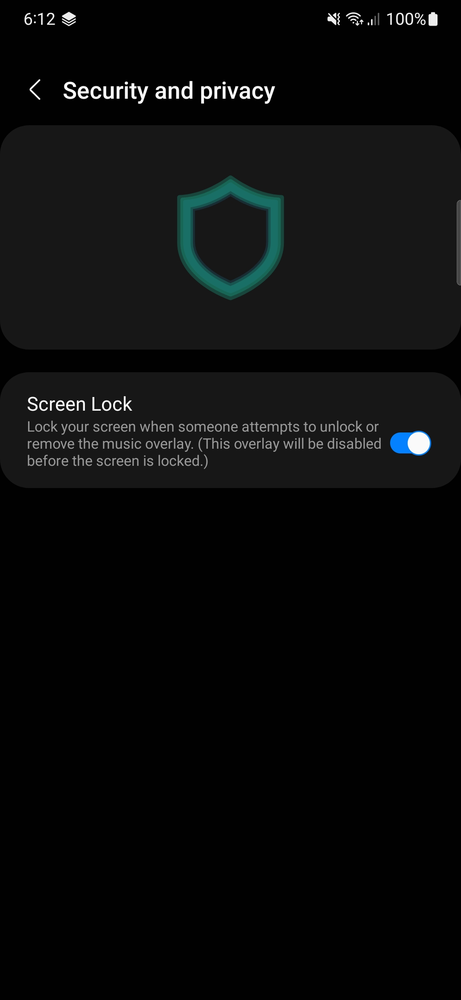      | 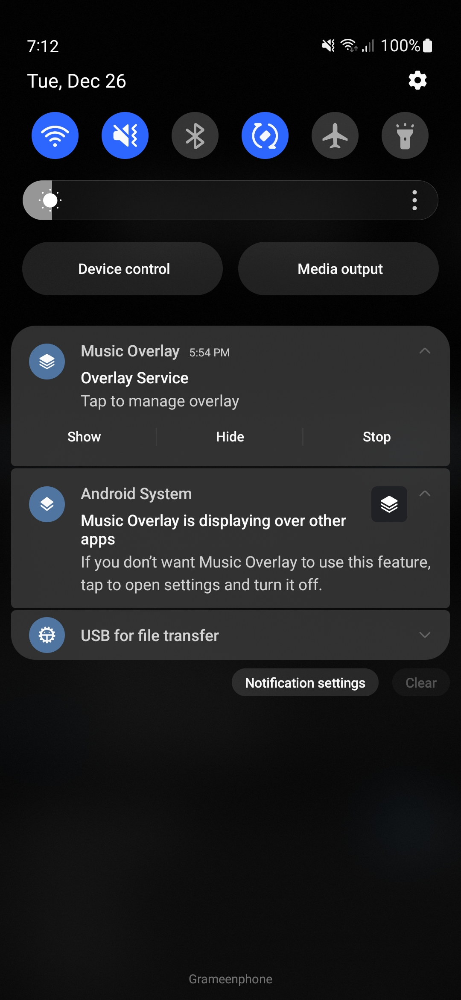 |

## Key Features:

- **Screen Off Playback:** Watch videos or listen to music with the screen turned off, conserving battery power and extending device lifespan.
- **Volume Control Gestures:** Extend the life of your volume buttons! Swipe up and down on the Music Overlay to effortlessly increase or decrease volume, ideal for devices with broken hardware volume buttons.
- **Customizable Floating** Handler: Access screen controls quickly with a customizable floating handler. Turn off the screen or unlock it with a simple tap.
- **Beautiful Visualizer:** Immerse yourself in a visually stunning music experience with the built-in visualizer, adding a dynamic element to your audio playback.
- **Always On Display:** Choose to keep a minimalistic Always On Display to glance at the time and notifications without fully unlocking your device.
- **Security Features:**
    - **Overlay Lock:** Prevent accidental touches with the overlay lock feature, ensuring a seamless and uninterrupted multimedia experience.
    - **Device Lock:** Safeguard your device against unauthorized attempts to hide or stop the overlay. Activate device lock to secure your multimedia content.

## How to Use:

1. Start your preferred multimedia app.
2. Activate Music Overlay.
3. Turn off the screen or adjust volume with intuitive gestures.
4. Customize the handler and visualizer to match your style.
5. Enhance security with overlay and device lock features.

## App Permissions

* POST_NOTIFICATIONS
* VIBRATE
* RECORD_AUDIO
* MODIFY_AUDIO_SETTINGS
* FOREGROUND_SERVICE
* WAKE_LOCK
* RECEIVE_BOOT_COMPLETED
* SYSTEM_ALERT_WINDOW

## 💕 Credit

* Icons by [svgrepo.com](https://www.svgrepo.com/)
* Lottie by [S M Rony](https://lottiefiles.com/110200-mobile-setting)
* One UI Design Components by [oneuiproject.github.io](https://oneuiproject.github.io/)

## 💻 Installation steps

Clone or download this project in your working directory, Open using android studio, Sync the
project, build & run the project.

## 🧑 Author

#### Md. Imam Hossain

You can also follow my GitHub Profile to stay updated about my latest projects:

If you liked the repo then kindly support it by giving it a star ⭐!

Copyright (c) 2023 MD. IMAM HOSSAIN